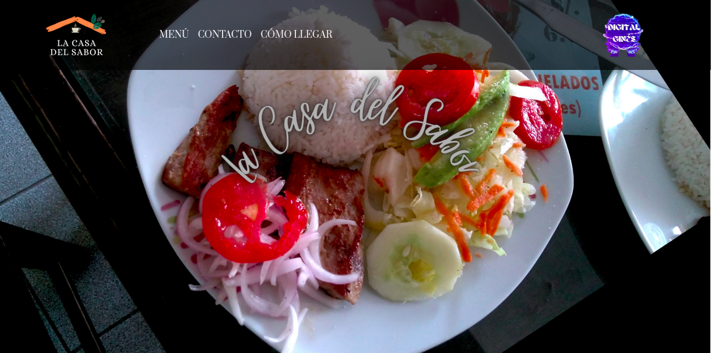
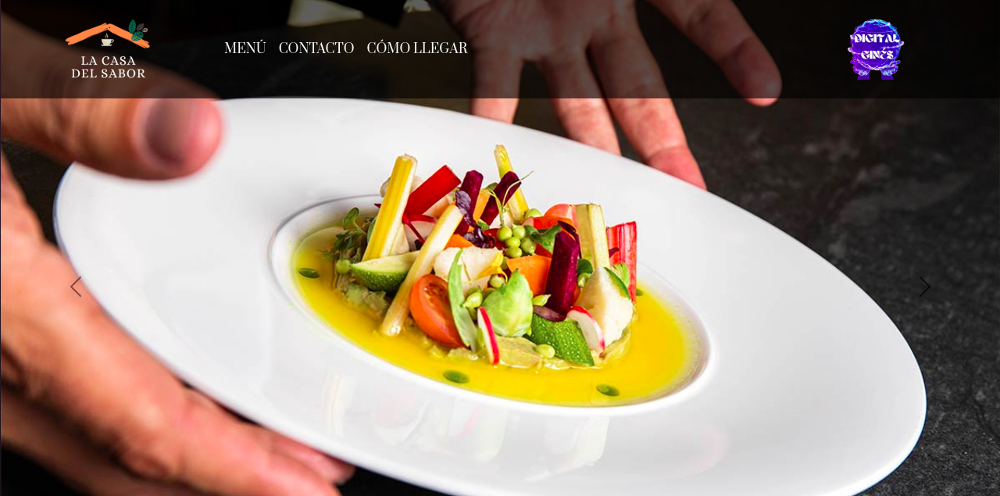
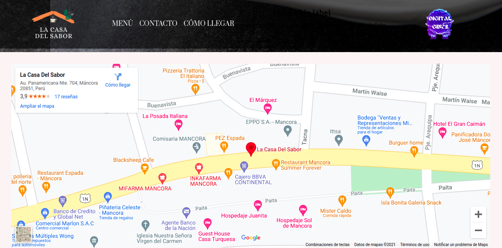
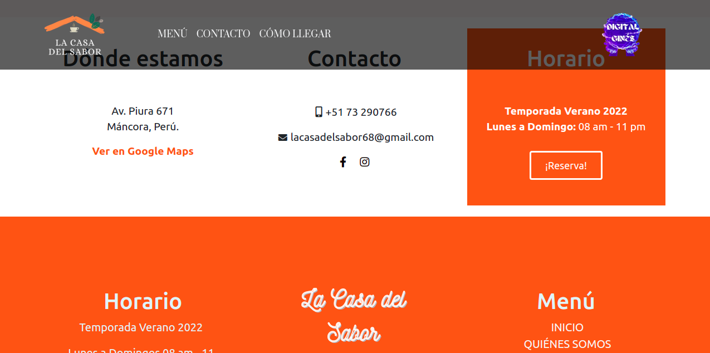
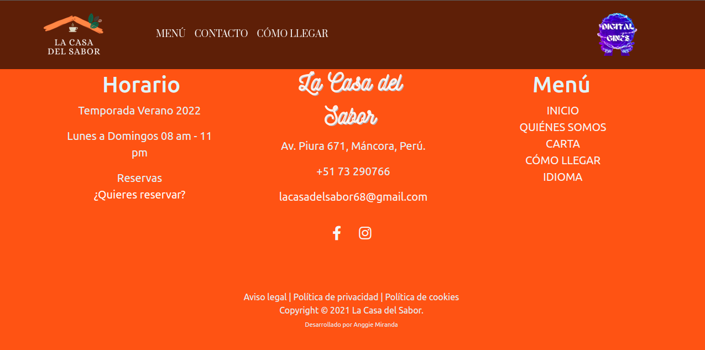

# potreroDigitalUnitedWay
<h1>Programación Front End</h1>

<strong>Potrero Digital un Programa de Compromiso.</strong>

Curso donde los estudiantes aprenden a desarrollar todas las funcionalidades requeridas para las diferentes secciones de un sitio o aplicación web. Se realizan trabajos prácticos semanales de forma obligatoria para el seguimiento de la cursada donde iré subiendo en este repositorio.

Lenguajes HTML | CSS | Github. Desarrollo de slider, menú flotante, menú desplegable, etc., con posibles aplicaciones a: porfolio de dibujos, imágenes, blog personal, sitio web para un emprendimiento personal, blog de noticias, y otros fines posibles.

Más info en:
https://www.potrerodigital.org/

<h2>Proyecto Final del programa</h2>

<h3>La Casa Del Sabor</h3>

Mi proyecto final se trata de un empredimiento de gastronomía, ubicado en las hermosas playas turísticas de MANCORA, Perú.
Se enfoca en los platos típicos del país y en un lema: "Comer como en casa", dando detalle a la comodidad del
cliente y que deguste los platillos hechos por manos profesionales y a la vez caseros, más deliciosos de la zona.
Tanto para los lugareños como para los turistas.

En éste proyecto use:

<ul>
  <li>HTML5</li>
  <li>CSS3</li>
  <li>Bootstrap</li>
</ul>

